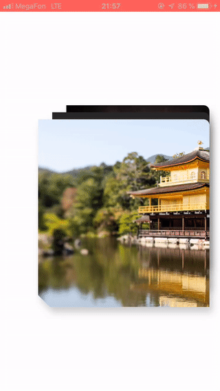

# StackedCardsContainer

[](https://travis-ci.org/vlz1996@mail.ru/StackedCardsContainer)
[](https://cocoapods.org/pods/StackedCardsContainer)
[](https://cocoapods.org/pods/StackedCardsContainer)
[](https://cocoapods.org/pods/StackedCardsContainer)

## Example


To run the example project, clone the repo, and run `pod install` from the Example directory first.

## How to set up ?

**Using CocoaPods (Recommended)**

To install it, simply add the following line to your Podfile:

```ruby
pod 'StackedCardsContainer'
```
Then you can install it with `pod install` command.

**Carthage _(SOON)_**

## How to use it? 

After install, make your UIView subclass of **_CardsViewContainer_** or create UIView in storyboard and set custom class **_CardsViewContainer_**


## Delegate & DataSource

Last step is to set delegate & datasource class. 

Congratulations, your are ready to start. 🎉

## Customization

Customizable properties
- **public var offset: CGPoint**

Property for change start point of the card. Default value CGPoint(x: 20, y: 30).

- **public let horizontalInset: CGFloat & public let verticalInset: CGFloat** 

These are for horizontal and vertical position changes. Default is CGPoint(x: 20, y: 30).

- **public let numberOfVisibleCards: Int** 

Property for set a number of visible cards in container. Default is 3.

The example of initialization of card. You can set custom view, background image of the card. Use support structs (Corners, CornersSizes) to set type of corner and size of cut-off corner.

```swift
    func card(forItemAtIndex index: Int) -> CardView {
        let corners = Corners(topLeft: .straight, topRight: .rounded, bottomRight: .straight, bottomLeft: .cutOff)
        let cornersSizes = CornersSizes(topLeftCutOff: 70, topRightCutOff: 70, bottomLeftCutOff: 20, bottomRightCutOff: 30, offset: 10, radius: 10)
        cardsViewContainer.offset = CGPoint(x: 60, y: 70)
        let color = colorArray[index]
        let view = UIView()
        view.backgroundColor = .clear
        let cardView = CardView(frame: CGRect(x: 0, y: 0, width: cardsViewContainer.bounds.width - 50, height: cardsViewContainer.bounds.height - 10), color: color, customView: view, corners: corners, cornersSize: cornersSizes)
        return cardView
    }
``` 

## Author

andrew@wearemad.ru

## License

StackedCardsContainer is available under the MIT license. See the LICENSE file for more info.
# StackedCardsContainer
